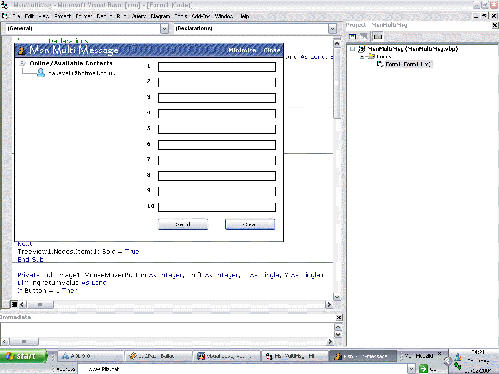



## MSN Multi\-Message

### Description

Uses the Messenger API and Sendkeys to send multiple messages to the selected contact.

Has a custom GUI. Zip file contains all images and icons.

Feedback welcome.
 
### More Info
 

             |
---                |---
**Submitted On**   |2004-07-25 18:54:20
**By**             |[Hakavelli](https://github.com/Planet-Source-Code/PSCIndex/blob/master/ByAuthor/hakavelli.md)
**Level**          |Beginner
**User Rating**    |5.0 (15 globes from 3 users)
**Compatibility**  |VB 6\.0
**Category**       |[Complete Applications](https://github.com/Planet-Source-Code/PSCIndex/blob/master/ByCategory/complete-applications__1-27.md)
**World**          |[Visual Basic](https://github.com/Planet-Source-Code/PSCIndex/blob/master/ByWorld/visual-basic.md)
**Archive File**   |[MSN\_Multi\-1827191282004\.zip](https://github.com/Planet-Source-Code/hakavelli-msn-multi-message__1-57621/archive/master.zip)

